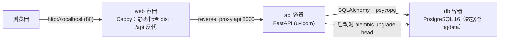

# hello-todo 架构设计说明

> 本文档随代码演进持续更新；重大变化必须同步。最后更新：2026-10-07

## 1. 系统概览

- 一句话：一人公司 hello 级演练项目，一个最小待办（Todo）全栈应用，用于端到端验证数字员工 Linus 的 SOP 全流程
- 当前能力：任务的列表 / 新增 / 勾选完成 / 删除；本地 Docker Compose 一键部署

## 2. 总体架构



- web：Caddy 单容器承担「前端静态托管 + API 反向代理」，SPA 路由回退到 index.html
- api：FastAPI 分层 routers → services → repositories；启动时先跑 Alembic 迁移再拉起 uvicorn
- db：PostgreSQL 16 官方镜像，命名数据卷持久化

## 3. 目录结构与分层

```text
frontend/src/
├── api/         # axios 封装层（client.js 实例 + tasks.js 资源方法），组件不直接发请求
├── components/  # 通用组件（TaskItem.vue），PascalCase，一文件一组件
├── stores/      # Pinia 状态（tasks.js：任务列表与 actions）
├── views/       # 页面（HomeView.vue）
└── router/      # Vue Router

backend/app/
├── routers/     # 路由层：参数解析与响应，禁止写 SQL
├── services/    # 业务逻辑：校验、规则、异常翻译
├── repositories/# 数据访问：SQLAlchemy CRUD
├── models/      # SQLAlchemy 模型（DeclarativeBase + Mapped）
├── schemas/     # pydantic 请求/响应模型
└── core/        # config（pydantic-settings）、database（engine/session/Base/get_db）
```

分层纪律：routers 只做 IO，services 只做业务，repositories 只碰数据库；反向依赖禁止。

## 4. 核心数据模型

| 表 | 字段 | 说明 |
|---|---|---|
| tasks | id (PK, int) | 自增主键 |
| tasks | title (varchar(200), not null) | 任务标题，去空格后非空才允许入库 |
| tasks | done (boolean, default false) | 完成状态 |
| tasks | created_at (timestamptz, default now) | 创建时间 |

迁移历史：alembic/versions/0001_create_tasks.py（初始建表）

## 5. 关键流程

以「新增任务」为例：

```text
浏览器输入 → Pinia action → api/tasks.js (axios) → POST /api/tasks
→ routers/tasks.py（pydantic 校验）→ services（标题规则）→ repositories（insert）
→ PostgreSQL → 201 响应 → store 更新 → 视图刷新
```

## 6. 外部依赖与配置

- 无第三方服务；配置全部走环境变量（见 .env.example）：
  - `DATABASE_URL`：API 连接串（compose 内指向 db 服务）
  - `POSTGRES_USER / POSTGRES_PASSWORD / POSTGRES_DB`：db 容器初始化

## 7. 非功能性设计

- 性能/并发：hello 级规模无专项要求；api 单容器单进程即可
- 安全：pydantic 全量入参校验；SQL 全走 ORM；密钥只存在于 .env（不入库）；CORS 仅放行 localhost 开发端口
- 错误处理：service 层抛业务异常 → 统一翻译为 400/404；禁止裸 except
- 日志：uvicorn 访问日志 + 应用级 logger（暂未接集中日志，hello 级不需要）

## 8. 已知限制与后续计划

- 单容器单库，无备份策略（本地演练环境；上云时按 ADR-0001 配 pg_dump + 快照）
- 无鉴权（公开演示接口）；真实业务项目启用 PyJWT + passlib（已入技术宪法扩展组件）
- 已配：GitHub Actions CI（`.github/workflows/ci.yml`，测试 + 构建验证，2026-10-07）；后续：上云（见 docs/adr/0001）
